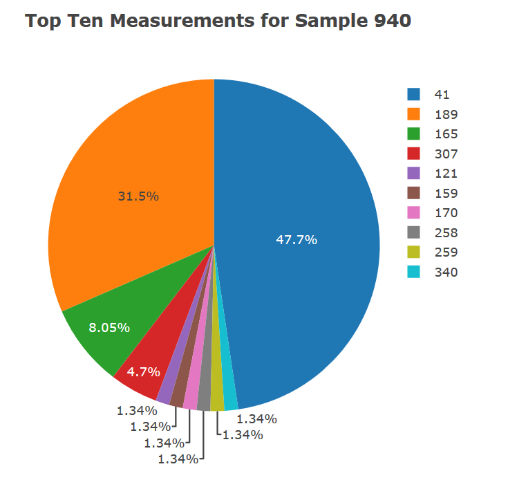
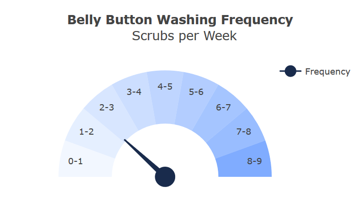

# RMJ - Homework 15 Interactive Visualizations and Dashboards

## Belly Button Biodiversity

Build an interactive dashboard to explore the Belly Button Biodiversity DataSet.

Visit my [Heroku app with interactive dashboard](https://herokubelly.herokuapp.com/)

-----------------------------------------------------------------------------------------------------------------------
## Step 1 - Plotly.js 

Create a PIE chart that uses data from your samples route ```(/samples/<sample>)``` to display the top 10 samples.

```js
 // PIE CHART
    var pieChart = [{
        values : bacteriaData['sample_values'].slice(0, 10),
        labels : bacteriaData['otu_ids'].slice(0, 10),
        hovertext : bacteriaData['otu_labels'].slice(0, 10),
        hoverinfo: 'hovertext',
        type: 'pie'
    }];

    var pieLayout = {
        title: `<b>Top Ten Measurements for Sample ${sample}</b>`,
        // height: 450,
        // width: 450
    };

    // display the pie chart
    Plotly.newPlot('pie', pieChart, pieLayout);
    })
  };

//END OF PIE CHART
    
```



  
Create a Bubble Chart that uses data from your samples route (/samples/<sample>) to display each sample.

```js
  // DATA TRACE

    var bubbletrace = {
      x: bacteriaData['otu_ids'],
      y: bacteriaData['sample_values'],
      text: bacteriaData['otu_labels'],
      mode: 'markers',
      opacity: 0.5,
      marker: {
        color: bacteriaData['otu_ids'],
        size: bacteriaData['sample_values']
      },
      type: 'scatter'
    };
    console.log(bacteriaData.sample_values);


   // BUBBLE CHART
    var bubbledata = [bubbletrace];

    var bubblelayout = {
      title: `Bubble Chart: For Bacteria Sample ${sample}`,
      hovermode: 'closest',
      autosize: true,
      xaxis: { title: 'OTU ID'},
    };

    //Display the bubble chart
    Plotly.newPlot('bubble', bubbledata, bubblelayout);

  // END OF BUBBLE CHART

```


Adapt the Gauge Chart to plot the Weekly Washing Frequency obtained from the route ```/wfreq/<sample>```

Update the chart whenever a new sample is selected

```js
//GAUGE PLOT

function buildGauge(wfreq) {

    // Enter the washing frequency between 0 and 180
    var wFraction = parseFloat(wfreq/9);
    
    // Trig to calc meter point
    var level = 180 * wFraction;
    var degrees = 180 - level;
    var radius = .5;
    var radians = degrees * Math.PI / 180;
    var x = radius * Math.cos(radians);
    var y = radius * Math.sin(radians);

    // Path: may have to change to create a better triangle
    var mainPath = 'M -.0 -0.025 L .0 0.025 L ',
    pathX = String(x),
    space = ' ',
    pathY = String(y),
    pathEnd = ' Z';
    var path = mainPath.concat(pathX,space,pathY,pathEnd);

    var data = [
      {
        type: 'scatter',
        x: [0],
        y: [0],
        marker: { size: 28, color: '192B4C' },
        showlegend: true,
        name: 'Frequency',
        text: level,
        hoverinfo: 'text+name'
      },
      {
        values: [50 / 9, 50 / 9, 50 / 9, 50 / 9, 50 / 9, 50 / 9, 50 / 9, 50 / 9, 50 / 9, 50],
        rotation: 90,
        text: ['8-9', '7-8', '6-7', '5-6', '4-5', '3-4', '2-3', '1-2', '0-1', ''],
        textinfo: 'text',
        textposition: 'inside',
        marker: {
          colors:[
            'rgba(0, 90, 255, .5)',
            'rgba(51, 123, 255, .5)',
            'rgba(76, 139, 255, .5)',
            'rgba(102, 156, 255, .5)', 
            'rgba(127, 172, 255, .5)',
            'rgba(153, 189, 255, .5)', 
            'rgba(178, 205, 255, .5)',
            'rgba(204, 222, 255, .5)', 
            'rgba(229, 238, 255, .5)',
            'rgba(255, 255, 255, 0)']},
        labels: ['8-9 scrubs', '7-8 scrubs', '6-7 scrubs', '5-6 scrubs','4-5 scrubs', '3-4 scrubs', '2-3 scrubs', '1-2 scrubs', '0-1 scrubs', ''],
        hoverinfo: 'label',
        hole: .5,
        type: 'pie',
        showlegend: false
      }
    ];

    var layout = {
      shapes: [{
          type: 'path',
          path: path,
          fillcolor: '192B4C',
          line: {
            color: '192B4C'
          }
        }],
      title: '<b>Belly Button Washing Frequency</b> <br> Scrubs per Week',
      // height: 450,
      // width: 450,
      xaxis: {
        zeroline: false,
        showticklabels: false,
        showgrid: false,
        range: [-1, 1]
      },
      yaxis: {
        zeroline: false,
        showticklabels: false,
        showgrid: false,
        range: [-1, 1]
      }
    };

    Plotly.newPlot('gauge', data, layout);

}
  
// END GAUGE PLOT

```




## HOMEPAGE


